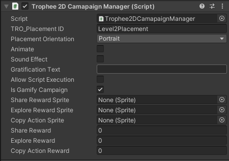

# 🎯 Gamify  Trophée Placements

In your **Trophée 2D Campaign Manager**, you will find a **Gamify Campaign** boolean option.

**Activating Gamify Campaign**

* If you **enable** this option, a new menu will appear, allowing you to configure **user rewards** based on interactions with the Trophée Canvas.
* To implement rewards, you need to call the associated functions from the **Trophée Manager** within your reward logic.

&#x20; 

<figure><figcaption></figcaption></figure>

<figure><figcaption></figcaption></figure>

**Reward Configuration**

The menu includes the following key fields:

1. **Reward Sprite**
   * Represents the **in-game reward icon** (e.g., coins, XP, or any other rewardable item).
2. **Reward Values**
   * **Share Reward (int):** Value of the reward granted when a player shares the campaign.
   * **Explore Reward (int):** Value of the reward given when a player explores the campaign.
   * **Copy Action Reward (int):** Value of the reward assigned when a player copies an action.

**Implementing Reward Logic**

* After setting up the reward values, you must invoke the appropriate functions from **Trophée Manager** within your game’s reward system.
*   These functions ensure that rewards are granted when players interact with the **Canvas Action Button** based on the configured actions. This setup enables players to view the benefits of each action and receive rewards accordingly.

    Once implemented, your Trophy Canvas will appear like this

<figure><figcaption></figcaption></figure>
